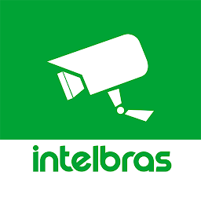

<p align="center">
  
</p>

<h1 align="center">Intelbras iSIC Cloud for Home Assistant</h1>

<p align="center">
  Open-source Home Assistant integration for remote Intelbras recorders,
  with an independently written Python P2P transport.
</p>

<p align="center">
  <a href="https://github.com/eduardobittencourt/intelbras-isic-ha/actions/workflows/validate.yml"></a>
  <a href="https://github.com/eduardobittencourt/intelbras-isic-ha/actions/workflows/test.yml"></a>
  
  
  <a href="LICENSE"></a>
</p>

[Português](docs/README.pt-BR.md)

This is an independent community project, without affiliation, endorsement or
support from Intelbras. Intelbras and iSIC are trademarks of their respective
owner. The original code is MIT licensed. The official iSIC Lite icon belongs to
Intelbras and is excluded from the MIT License; see [third-party notices](THIRD_PARTY_NOTICES.md).

## What it does

The integration creates one Home Assistant camera per recorder channel and
connects to the remote recorder using Intelbras Cloud discovery and direct IPv4
P2P. The cameras can be on a different network from Home Assistant. The Python
transport forwards RTSP over a loopback-only TCP proxy; no proprietary DLL,
native SDK, QEMU or ARM root filesystem is installed.

The H.264 substream supports live playback and JPEG snapshots. Device and Cloud
credentials stay in the private Home Assistant config entry and are redacted
from integration diagnostics.

## Requirements

- Home Assistant **2026.9.4 or newer**; HACS is recommended for installation.
- An Intelbras recorder or camera already working in iSIC Lite.
- Device serial, local device username/password and remote RTSP port.
- A **Cloud application key (`app_key`) and P2P password**, supplied separately.
- Outbound internet connectivity that permits direct UDP P2P with the recorder.

**Cloud credentials are not included.** They are application protocol parameters,
not the email/password of your Conta Intelbras and not the recorder password.
There is currently no implemented account-login flow that obtains them. Installing
through HACS does not provide them. If you do not already have credentials you
are authorized to use, this release cannot complete device setup. See
[Cloud credentials and research](docs/cloud-credentials.md).

## Install through HACS

[Open this repository in HACS](https://my.home-assistant.io/redirect/hacs_repository/?owner=eduardobittencourt&repository=intelbras-isic-ha&category=integration)

1. In **HACS → ⋮ → Custom repositories**, add
   `https://github.com/eduardobittencourt/intelbras-isic-ha` with category
   **Integration**.
2. Find **Intelbras iSIC Cloud**, select **Download** and choose the latest release.
3. Restart Home Assistant.
4. Open **Settings → Devices & services → Add integration** and search for
   **Intelbras iSIC Cloud**.
5. Enter the recorder configuration and the separately supplied Cloud credentials.

This repository is available as a **HACS custom repository**. It is not currently
included in the default HACS catalog.

For manual installation, copy `custom_components/intelbras_isic` from the release
into `/config/custom_components/`, restart Home Assistant and follow steps 4–5.

## Configuration

| Field | Meaning |
| --- | --- |
| Serial number | Device serial shown in iSIC Lite |
| Device username/password | Local account on the recorder, used for RTSP |
| Number of channels | Channels exposed in HA, from 1 to 32 |
| Video profile | H.264 substream (recommended) or the recorder's main stream |
| Remote RTSP port | RTSP port on the recorder, normally `554` |
| Cloud application key | Application key used to register with the P2P service |
| Cloud P2P password | Separate parameter used when negotiating the tunnel |

Setup verifies the P2P tunnel and an authenticated RTSP `DESCRIBE` on channel 1.
Use **Reconfigure** on the integration entry to change credentials or settings.

### Upgrading the private preview

Existing config entries and entity identifiers are preserved. Because previous
versions bundled Cloud credentials, upgrading prompts for reauthentication to
supply those parameters explicitly. Keep your existing parameters in your
private configuration before upgrading. Do not share them in issues or logs.

HACS can retain files from an earlier manual installation. After making a
backup, remove the obsolete directory
`/config/custom_components/intelbras_isic/bridge/` if present; keep the new
`bridge.py` file. That directory belongs to the old native runtime and is no
longer used.

## Entities

| Entity | Purpose | Default |
| --- | --- | --- |
| Camera channel | Live stream and JPEG snapshot | Enabled |
| P2P tunnel | Connection status | Enabled |
| Tunnel uptime | Current session uptime | Enabled |
| Bridge starts | Successful starts since HA loaded | Enabled |
| Configured channels | Configured camera channel count | Enabled |
| Stream profile | Selected video profile | Enabled |
| Local tunnel port | Ephemeral loopback port | Disabled |

Privacy-safe diagnostics are available from the integration's device page.

## Tested behavior and limitations

Direct IPv4 P2P and H.264 decoding were tested with the project owner's remote
eight-channel recorder, including all eight channels simultaneously. This is
experimental software; those results do not establish compatibility with every
Intelbras model, firmware or network.

- **Cloud relay, IPv6 negotiation and legacy peers without VDT are not implemented.**
  A recorder requiring relay may work in iSIC Lite and still fail here.
- Up to eight simultaneous TCP streams per recorder are supported. Snapshots and
  live sessions share this limit.
- Channel count is entered manually. The selected profile must be enabled on
  the recorder; actual codec depends on its configuration.
- A failed transport is recreated when the next camera source is requested;
  reconnecting an already-running video stream automatically needs further work.
- Intelbras Cloud remains an external dependency. Changes to its protocol,
  credentials or availability can interrupt connectivity.

See [Troubleshooting](docs/troubleshooting.md),
[Architecture](docs/architecture.md) and [Security](SECURITY.md).
The release was also installed through HACS on the owner's HA instance;
see [Installation validation](docs/hacs-install-validation.md).

## Contribute

Community research can help document supported credential provisioning, improve
relay/IPv6 support and test more models. Please contribute original code and
sanitized observations; keep vendor binaries, real credentials, serials and
camera images out of public contributions.

```bash
python -m pip install -e '.[test]'
ruff check .
ruff format --check .
pytest
```

See [CONTRIBUTING.md](CONTRIBUTING.md),
[Transport provenance](docs/transport-provenance.md) and
[THIRD_PARTY_NOTICES.md](THIRD_PARTY_NOTICES.md). The public history begins with
source-only code. Protocol research included inspection of the private reference
binary; this was not a clean-room implementation.
