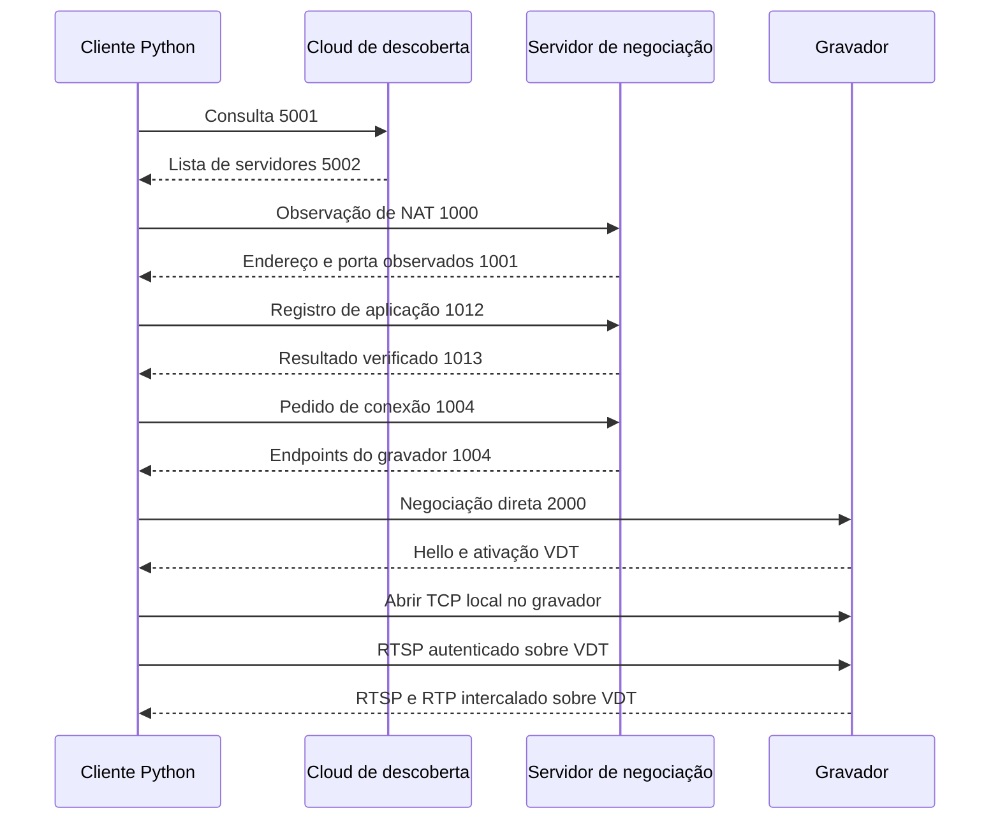

# Formato implementado e evidência

Este documento descreve somente o subconjunto observado e implementado.
Não é documentação oficial do fornecedor. Os nomes das etapas são nossos.
Os números e os layouts foram verificados com o equipamento do proprietário;
as respostas de outros firmwares podem diferir.

## Etapas

O socket de registro e o socket de sessão do gravador são distintos. A oferta
do equipamento pode chegar ao socket de registro, enquanto a confirmação do
pedido chega ao socket de sessão. Ignorar o primeiro impediria a conexão.

## Cloud e negociação

As mensagens dessa família começam com dois `uint16` little endian:
assinatura `0x2012` e tipo. Descoberta: 5001/5002. Observação NAT: 1000/1001.
Registro: 1012/1013. Conexão: 1004/1005. Hello direto: 2000/2001.

Na resposta de descoberta, os primeiros 16 bytes são a chave do TEA; um
`uint32` little endian na posição 16 informa o tamanho do ciphertext na
posição 20. A mensagem decifrada é uma lista ASCII com linhas de três campos:
`ipv4:porta|hostname|hostname_ipv6`. A implementação verifica tamanhos,
endereços e portas antes de usá-los.

O pedido de registro tem 160 bytes: cabeçalho e aleatoriedade de 16 bytes,
chave de aplicação com 32 bytes cifrada por TEA, identidade do cliente com
100 bytes e três valores `uint32` (versão, tipo NAT e tipo de cliente).
A resposta de 52 bytes devolve resultado, intervalo, timestamp e chave
cifrada. O cliente verifica aceitação, tempo e igualdade da chave.

O pedido de conexão contém a identidade do cliente, o serial de destino,
endereços observados e locais, versão e hash MD5 da senha P2P. As senhas P2P,
de aplicação e RTSP cumprem funções distintas; nenhuma é descoberta ou
incluída nos testes publicados. MD5 e TEA são requisitos de compatibilidade
desse protocolo legado, não algoritmos escolhidos para um novo protocolo.

## Transporte VDT

O cabeçalho começa com os bytes `12 01 10`, seguidos do comando. Os campos
numéricos internos de VDT usam network byte order:

| Comando | Função implementada |
| --- | --- |
| 0 | Hello com timestamp, sequência e janela |
| 1 | Resposta ao hello |
| 2 | Dados com sequência e tamanho |
| 3 | ACK, sequência máxima e lista de pacotes ausentes |
| 4 | Solicitação de ACK |
| 5 | Sondagem de MTU |
| 6 | Resposta à sondagem de MTU |

O cliente anuncia janela limitada, reordena, descarta duplicações e solicita
retransmissão dos intervalos ausentes. O envio divide payloads em até 1200
bytes e limita tentativas e pacotes pendentes. Contadores e identificadores
estão separados de credenciais e URLs.

O fluxo ordenado leva frames de aplicação com cabeçalho little endian
`uint16 client_id`, `uint16 type`, `uint32 length`, seguido do payload. O tipo
0 carrega bytes do TCP. O cliente 65535 representa controle: tipo `0xFF01`
abre a conexão e `0xFF02` fecha. O pedido de abertura contém o identificador
do stream, endereço `127.0.0.1` no gravador e porta TCP de destino.

O hello deve ser enviado nos dois sentidos: responder apenas ao hello do
equipamento não anuncia a janela de recepção e impede o retorno do vídeo.

## Subconjunto pendente

Relay, negociação IPv6 e variações legadas sem VDT não estão implementados.
A comunicação depende do firmware e do serviço remoto. Para eliminar também
o cloud, seria necessário acesso IP direto/VPN ou um mecanismo alternativo que
o gravador aceite; este cliente não transforma o firmware em software nosso.
